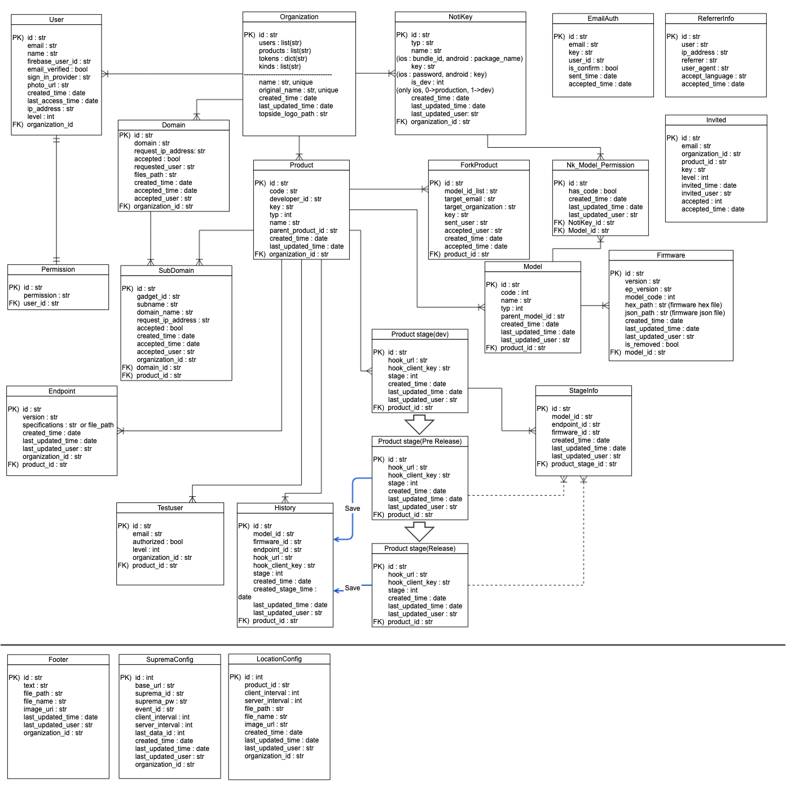

# SmartSystem

## Requirment
    upper Python3.7
    redis

# 1. Develop Installation

### 1. Setup virtual environment and Execute
    pip install virtualenv
    virtualenv venv_console
    source venv_console/bin/activate

### 2. Clone the project
    git clone git@g.thenaran.com:/apps/console.git
    cd console

### 3. Install requirements
    pip install -r requirements.txt

### 4. Install docker
  * docker install referrence : https://subicura.com/2017/01/19/docker-guide-for-beginners-2.html

### 5. redis install and run
    docker pull redis
    docker run --name some-redis redis -p 6379:6379 redis

### 6. Run the console
    cd src
    python run.py

### 7. Go the http://127.0.0.1:16000

### 8. Quit
    ctrl + c
    deactivate

# Using gunicorn
    gunicorn -w 3 --certfile ssl/mib_io.crt --keyfile ssl/mib_io.key -b 127.0.0.1:5000 run:__app
    gunicorn -k geventwebsocket.gunicorn.workers.GeventWebSocketWorker -w 1 -b 0.0.0.0:5000 run:__app

# Using MySQL for Google Cloud SQL
    wget https://dl.google.com/cloudsql/cloud_sql_proxy.linux.amd64 -O cloud_sql_proxy
    chmod +x cloud_sql_proxy
    ./cloud_sql_proxy -instances=protacloud:us-west1:console=tcp:3306 -credential_file=console_db.json

# Live Run
    cd console/cloud_sql
    nohup ./cloud_sql_proxy -instances=protacloud:us-west1:console=tcp:3306 -credential_file=console_db.json
    cd src
    nohup gunicorn -w 3 -k gevent --certfile ssl/mib_io.crt --keyfile ssl/mib_io.key -b 127.0.0.1:5000 run:__app
    nohup celery -A worker.worker worker --loglevel=debug

# DataBase
